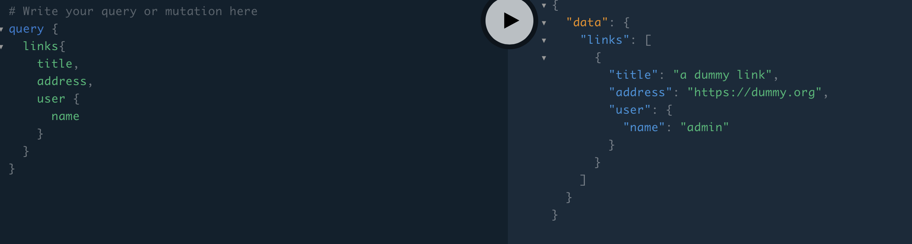
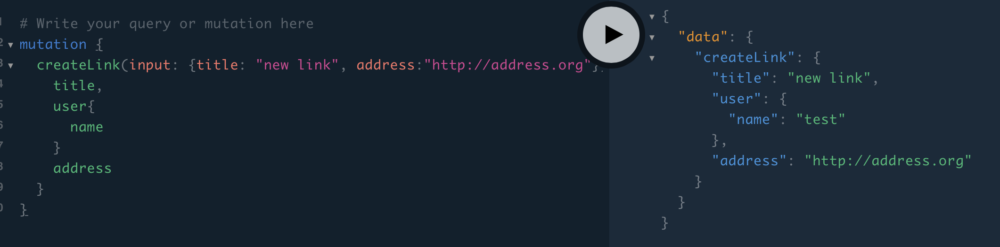

# GraphQL Practice Repo Danin

## Ceritanya disuruh belajar GQL

### Project Status

About halfway done? Udah belajar tentang apa itu GQL, queries, mutations, subscription, how it works etc. Tutorial from [here](https://www.howtographql.com/graphql-go/0-introduction/). Belum sampe pasang DB tapi.

Tutorialnya minta pasang DB, yang dia sih pakai MySQL, tapi kalo ga salah kita bakal pakai Postgres, dan saya belum nyoba2 setting DB postgres di laptop ini. I'll work on it eventually.

### What I learned:

- GQL is essentially an API interface like REST API
- My tutorial says it's better REST, but my friend says it is sometimes better but also sometimes not. Helps with underqueries and overqueries, is better for rapid production, but is not very good for customization. I'll look into it later
- GQL uses queries and mutations to a single endpoint and is able to retrieve specific data in a single query, I think

### Some screenshots

Query

Mutation
